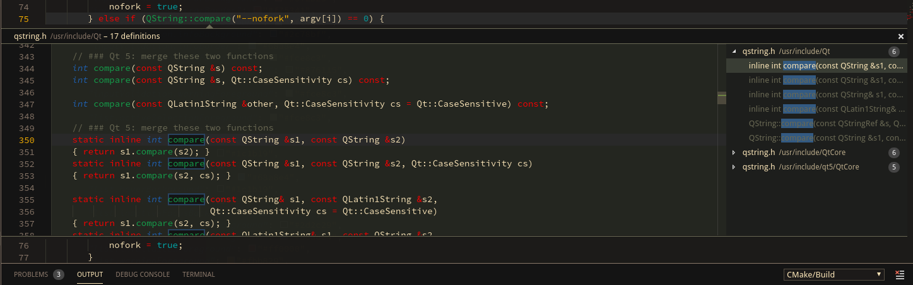

Srcery theme for Visual Studio Code, based on
[srcery-colors/srcery-vim](https://github.com/srcery-colors/srcery-vim)


## Install

Search for the `Srcery` theme in the
[marketplace](https://marketplace.visualstudio.com/items?itemName=srcery-colors.srcery-colors)


## Screenshot (v0.3.3)

### UI panels/bars

This code is from the neovim-qt project.


### Peek



## Troubleshooting

### Work in progress
This theme is a work in progress, if you see something that is off or
doesn't work please open an [issue](https://github.com/srcery-colors/srcery-vscode/issues/new) so it can be fixed.

### See what's coming / contribute
It is actually fairly easy to see what the current git repository is setting as a colorscheme before it is released.
This is a little like having an "Insiders" version of the theme, while the colorscheme (for the UI especially) is
still being polished :

- Clone the Git repository somewhere.
- Open the folder in VSCode.
- Add this launch configuration in your `launch.json` :
```json
// A launch configuration that launches the extension inside a new window
{
    "version": "0.1.0",
    "configurations": [
        {
                "name": "Extension",
                "type": "extensionHost",
            "request": "launch",
            "runtimeExecutable": "${execPath}",
            "args": ["--extensionDevelopmentPath=${workspaceRoot}" ]
        }
    ]
}
```
- And now, when you launch 'Extension', you will have another instance of Visual Studio code with all your settings,
except that the colorscheme will be loaded from the cloned repo instead of being pulled from your extensions.


## Attribution

Thanks to [bpruitt-godard](https://github.com/bpruitt-goddard/vscode-sourcerer) for his port of Sourcerer, which
helped me a lot to build a first working port of Srcery theme.
