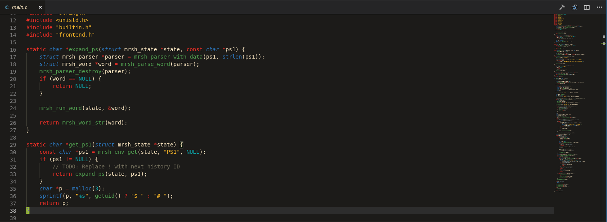
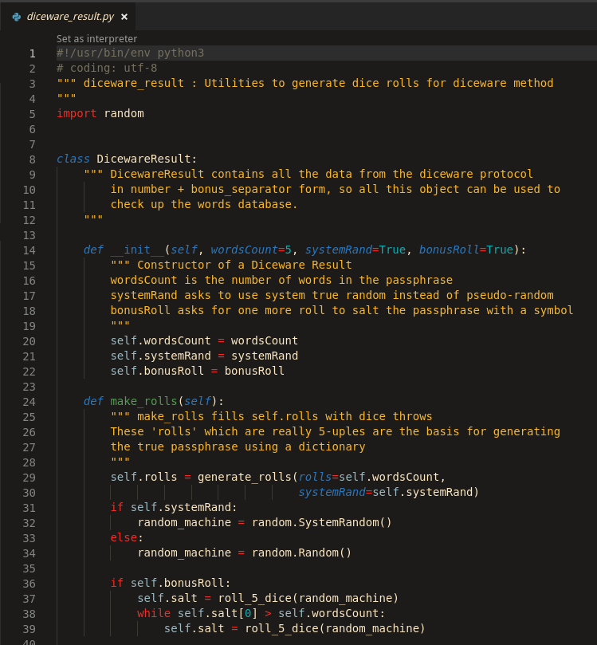

# Srcery Theme

Srcery theme for Visual Studio Code, based on
[srcery-colors/srcery-vim](https://github.com/srcery-colors/srcery-vim)

## Install

Search for the `Srcery` theme in the marketplace

## Screenshots

### C

### Python

### Peek // Rust

